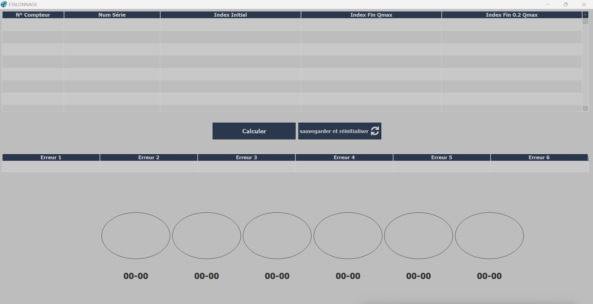

# Industrial Gas Meter Calibration Software (G4/G6)

Professional desktop application developed in-house at **EN-AMC (later SAIEG — Sonelgaz Group)** for the calibration of **Sagem G4 and G6 gas meters** on an existing metrological test bench.

After the previous bench software became unusable, I designed and developed a replacement application that restored software-assisted calibration on that station. I also simplified the operator workflow by bringing the main data-entry, calculation, result-display and save/reset steps together on a single working screen instead of requiring repeated navigation across several windows.

## At a glance

| Area | Details |
|---|---|
| Professional context | EN-AMC (later SAIEG — Sonelgaz Group) |
| Application | Windows desktop calibration software |
| My role | Application design and development |
| Technologies | WINDEV / WLanguage, Microsoft Access |
| Meter variants | Sagem G4 and G6 |
| Main outcome | Restored the affected bench workflow and simplified the operator process |

## Project context

The test bench was one of several calibration/testing resources used in the factory. Operators performed meter measurements on the bench, and the application converted those readings into practical correction guidance.

The physical adjustment relied on changing a gear-wheel combination in the meter mechanism. Different wheel combinations produced different correction ranges, so the software had to calculate the meter error and map it to the appropriate correction reference.

## My contribution

I independently designed and developed the application, including:

- the operator-facing desktop interface;
- the mathematical correction algorithm;
- separate G4 and G6 variants within the same project family;
- mapping between calculated correction ranges and gear-wheel references;
- visual and numeric presentation of results;
- automatic serial-number progression with manual adjustment when needed;
- local storage for calibration history and related operational data.

I worked with the plant technical department to understand the calibration process and also used technical input from a visiting engineer representing the meter supplier/manufacturer.

## How the application worked

For each meter position, the operator worked with:

- the meter position/number;
- a serial number that normally advanced automatically, with manual adjustment available when required;
- the initial index;
- the final index at **Qmax**;
- the final index at **0.2 Qmax**.

The application then:

1. calculated the error/correction from the entered readings;
2. determined the applicable correction range;
3. mapped that range to a gear-wheel reference;
4. displayed the result numerically and visually;
5. saved the operation before resetting the screen for the next cycle.

Original project material also includes a correction table linking wheel references, correction ranges and display colors.

## Operational impact

The failure of the previous software had made this calibration station unavailable for its normal software-assisted workflow.

The replacement application returned the affected test bench to operational use and removed a software blocker from one part of the factory's calibration and production process.

It also made the operator workflow more direct. The main entry, calculation, result and save/reset actions were consolidated on one screen rather than spread across several windows as in the previous software. This reduced unnecessary navigation and made each calibration cycle more practical to perform.

The bench was one of several calibration/testing resources in the factory, so the impact is presented at the workstation and process level rather than as a factory-wide production metric.

## Technical profile

| Area | Implementation |
|---|---|
| Application type | Windows desktop application |
| Development environment | WINDEV / WLanguage |
| Meter variants | G4 and G6 |
| Local storage | Microsoft Access |
| Main stored data | date/time, meter position, indexes, calculated error, wheel reference, serial number |
| Main workflow | readings → error/correction calculation → gear-wheel guidance → result display → save/history |

The original project remains in WINDEV's native project format. This repository therefore focuses on the application workflow, technical design and selected evidence rather than republishing proprietary project files or reconstructing source code.

## Evidence

The case study is supported by original professional artifacts, including:

- separate G4 and G6 WINDEV project branches;
- the main application interface;
- the local Microsoft Access database and matching data definitions;
- the gear-wheel correction mapping;
- project windows and backup/history artifacts.

Only selected, sanitized evidence is published. Raw databases, internal project files, operational records and internal paths remain private.

See:

- [Technical Notes](docs/technical-notes.md)
- [Evidence & Confidentiality](evidence/README.md)

## Scope note

This case study covers the G4/G6 calibration application itself. A separate companion application for gear-wheel consumption and supply statistics is outside the scope of this repository.
